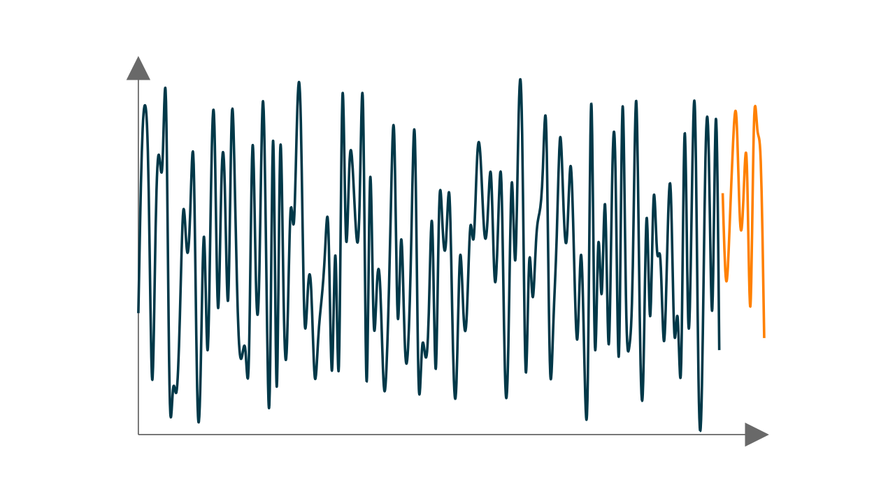

# Manim Example
This repo shows a example with  how to use tabular data with the visualization framework [manim](https://www.manim.community/).

## Plot
Create a lineplot with timeseries data.

## Animation
